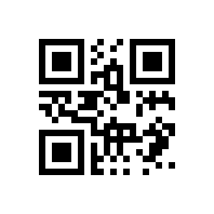

# php-qrcode

[](LICENSE)
[](https://www.php.net/)

Generate QR codes in pure PHP. `php-qrcode` is a small, single-file QR
code generator with PNG and SVG output.

## 🔍 What is php-qrcode?

`php-qrcode` can be used either as a PHP class in an application or as
a standalone HTTP endpoint. It is distributed as one file and does not
require Composer:

- PNG output through PHP's GD extension
- SVG output without GD
- Automatic numeric, alphanumeric, binary, and Kanji encoding
- QR error correction levels L, M, Q, and H
- Configurable size, padding, colors, module density, and quiet area

## 📦 Installation

1. Copy [`qrcode.php`](qrcode.php) into your project.
2. Use PHP 8.1 or later.
3. Enable the GD extension if you need PNG output.

There is no installation step beyond copying the file.

## ✨ Usage

### As a PHP class

Include `qrcode.php`, create a `QRCode`, and render the format you
need:

```php
<?php

require 'qrcode.php';

$opts = [
    's'  => 'qr-m',
    'sf' => 8,
    'p'  => 16,
];

$generator = new QRCode('https://example.com', $opts);

// Write a PNG to the current output stream.
$generator->output_image();

// Or render a GD image for further processing.
$image = $generator->render_image();
imagepng($image, 'qrcode.png');
```

SVG output is available without the GD extension:

```php
<?php

require 'qrcode.php';

$opts = ['s' => 'qr-h'];

$generator = new QRCode('https://example.com', $opts);

$svg = $generator->render_svg();
file_put_contents('qrcode.svg', $svg);

// Or send it directly in an HTTP response.
// $generator->output_svg();
```

### As an HTTP endpoint

When `qrcode.php` is requested directly, it reads the data and options
from GET or POST parameters:

```text
qrcode.php?d=HELLO%20WORLD&s=qr-m&sf=8&p=12
```

PNG is the default format. Request SVG with either `f=svg` or
`format=svg`:

```text
qrcode.php?d=https%3A%2F%2Fexample.com&s=qr-h&format=svg
```

## 🎛️ Options

Options can be passed to the `QRCode` constructor or supplied as
request parameters when using the HTTP endpoint.

| Option | Default | Description |
| --- | --- | --- |
| `s` | `qrl` | Error correction level: `qr-l`, `qr-m`, `qr-q`, or `qr-h`. Separators are optional, so `qrl` also works. |
| `d` | empty | Data to encode. For Kanji mode, provide Shift-JIS encoded data. |
| `w` | calculated | Output width in pixels. Overrides `sf`/`sx`. |
| `h` | calculated | Output height in pixels. Overrides `sf`/`sy`. |
| `sf` | `4` | Scale factor for both axes. |
| `sx` | `sf` | Horizontal scale factor. |
| `sy` | `sf` | Vertical scale factor. |
| `p` | `0` | Padding on all sides. |
| `pv` | `p` | Top and bottom padding. |
| `ph` | `p` | Left and right padding. |
| `pt` | `pv` | Top padding. |
| `pl` | `ph` | Left padding. |
| `pr` | `ph` | Right padding. |
| `pb` | `pv` | Bottom padding. |
| `bc` | `FFFFFF` | Background color as hexadecimal RGB. |
| `fc` | `000000` | Foreground color as hexadecimal RGB. |
| `md` | `1` | Module density from `0` to `1`. Lower values create space between modules. |
| `wq` | `1` | Quiet-area width in units. Set to `0` to remove it. |
| `wm` | `1` | Width of QR modules in units. |
| `f` / `format` | `png` | HTTP output format. Use `svg` for SVG; all other values produce PNG. |

## 🖼️ Examples

Default black-and-white PNG:



Custom colors and high error correction:


## 🎮 Sandbox

[`sandbox.html`](sandbox.html) is an interactive playground for trying
options without writing code. It calls the HTTP endpoint and
live-previews the result as you change the data, error correction
level, scale, module density, and PNG/SVG format.

## 📜 License and credits

This project is licensed under the [MIT License](LICENSE).

The QR encoding implementation is based on
[Kreative Software's barcode project](https://github.com/kreativekorp/barcode).
Portions are Copyright (c) 2016-2018 Kreative Software. Other project
portions are Copyright (c) 2019 Donald Becker.
